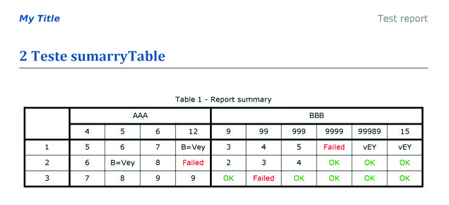
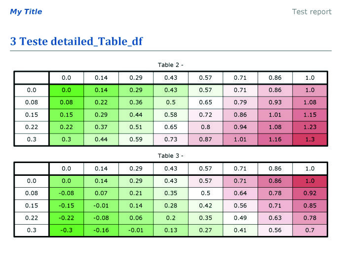

# reportlabAPI: an API to work with reportlab and pdfrw 

The images present in this documentation is the PDF report generated
after all the codelines runs.

## Getting started

First you can import some modules like:
``` python
    from reportlabAPI import (build_doc, build_cover, addPageBreak,
                          new_chapter, addSubtitle, build_credits,
                          save_doc, sumarryTable, detailed_Table_df,
                          MSG_COMPLY, MSG_NOT_COMPLY)

    # You need this modules to create some of the strucutres presents
    # in the package

    # Just give a ``pip install numpy pandaswebbrowser`` in your
    # favorite IDE python

    import numpy as np
    import pandas as pd
    from webbrowser import open as openf
```

For this report style you can set the ``title`` and the 
``description`` for the cover:

``` python
    title = 'My Title'
    desc = 'My Description'

    build_doc(title, desc)

    members = ['Membro 1', 'Membro 2', 'Membro 3']

    acknow = 'This project is the result of an agreement between member 1 and ' + \
        'member 2.'
```


Create a new ``chapter``:

``` python
    new_chapter('Subtitle Tests')
```

And add some ``subtitles``:

``` python
    addSubtitle('Subltile 1')

    addSubtitle('Subltile 2')
```


Create some ``summaryTables`` like that:

```python
    df1 = pd.DataFrame({4:{1:5, 2:6, 3:7},
                       5:{1:6, 2:'B=Vey', 3:8},
                       6:{1:7, 2:8, 3:9},
                       12:{1:'B=Vey', 2:MSG_NOT_COMPLY, 3:9}})

    df2 = pd.DataFrame({9:{1:3, 2:2, 3:MSG_COMPLY},
                        99:{1:4, 2:3, 3:MSG_NOT_COMPLY},
                        999:{1:5, 2:4, 3:MSG_COMPLY},
                       9999:{1:MSG_NOT_COMPLY, 2:MSG_COMPLY, 3:MSG_COMPLY},
                       99989:{1:'vEY', 2:MSG_COMPLY, 3:MSG_COMPLY},
                       15:{1:'vEY', 2:MSG_COMPLY, 3:MSG_COMPLY}})

    sumarryTable(df1, df2, master_rows_name=('AAA', 'BBB'))
```



Or with some lines of code ``colorful detailed tables`` like that:

```python
    def soma2(a,b):
        return a + b


    def subt2(a,b):
        return a - b
     

    columns = np.linspace(0,1, 8)
    lines = np.linspace(0,.3, 5)

    somaTable = []
    subtTable = []

    for j in lines:
        
        each_line_soma = {}
        each_line_subt = {}
        
        for i in columns:
            res_soma = soma2(i, j)
            res_subt = subt2(i, j)
            
            each_line_soma[i] = res_soma
            each_line_subt[i] = res_subt
        somaTable.append(each_line_soma)
        subtTable.append(each_line_subt)
            
    df_soma = pd.DataFrame(somaTable, index=lines)
    df_subt = pd.DataFrame(subtTable, index=lines)

    max1 = df_soma.max().max() / 2
    max2 = df_subt.max().max() / 2

    new_chapter('Teste detailed_Table_df')

    detailed_Table_df(df_soma, maxValue=max1)
    detailed_Table_df(df_subt, maxValue=max2)
```



Also ``no color detailed tables``:

```python
    new_chapter('detailed_Table_nocolor')

    detailed_Table_df(df_soma, maxValue=max1, mode='no_color')
    detailed_Table_df(df_subt, maxValue=max2, mode='no_color')
```


And ``limitation detailed tables``:

```python
    new_chapter('detailed_Table_red_limit')

    detailed_Table_df(df_soma, maxValue=max1*1.5, minValue=0, mode='red_limit')
	detailed_Table_df(df_subt, maxValue=max2*1.5, minValue=0, mode='red_limit')
```


For finish you can set a list of ``member`` and 
``acknowledgements`` for the credits:

```python
    members = ['Member 1', 'Member 2', 'Membro 3']

    acknow = 'This project is the result of an agreement between member 1 and ' + \
        'member 2.'

    build_credits(acknow, members)
```


And ``save`` and open using this codeline:
```python
    openf(save_doc('Test_', withDate=True))
```

This is the final result:


